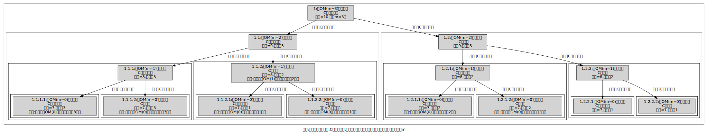
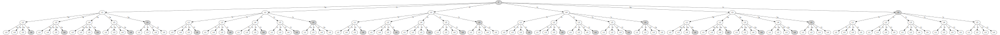
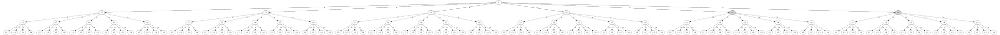
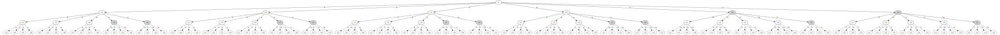
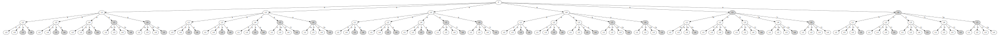
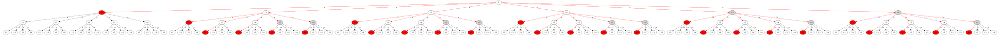
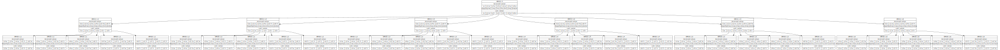
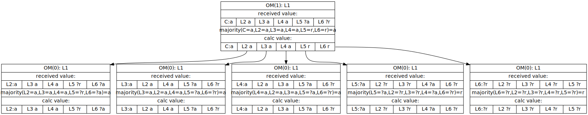

#拜占庭将军问题学习手记

## 为什么会有这个手记
说起来有点尴尬， 两三年前就以为自己搞明白了拜占庭将军问题的解法，但是再次复习的时候发现，当推演m>1以上的叛徒时候，居然不知所措，原来是一直没搞明白，却以为搞明白了。都是被m=1的简单实例骗了。于是，就研读论文的证明过程，并写了一段程序来生成推演图，以帮助理解。

##解决什么问题

 一个由多个组件组成的系统的一个或者多个组件失效的时候时候的可靠性问题。这是分布式系统的基础性问题。   
讨论失效的组件的数量边界和如何保持可靠性的方法。也即解决如下问题:
   
1.    由n个组件组成的系统，有多少个组件失效的时候，系统仍然可靠。(失效边界，假设这n个组件是相同的，可以相互代替，会容易理解一点)   
2.  采用什么方法来保证这个可靠性。

##模型的假设和解决算法（来源于网络上的摘抄）
拜占庭将军问题是作者Lamport(对，就是LaTex 的La的那个符号代表的那个大牛)效仿 Dijkstra(对，就是那个提出结构化程序设计的，发明PV原语的,创造最短路径，我每次都读不对名字的的大神) 的哲学家就餐问题(对，就是那个认为哲学家每天除了吃饭就是思考的假定)的做法。

用拜占庭将军来比拟组件，忠诚的将军比拟正常工作的组件，叛徒将军比拟有故障的组件。  
为什么用叛徒来做比喻呢？是因为一个失败的组件：要么没有响应，要么向系统的其他部分发送相矛盾的信息。跟叛徒挺像的:通过发布干扰信息或阻拦关键信息来干扰正常决策。

鉴于前人之述备矣，就不重新写轮子了，找一个论文翻译版本，剪辑一下贴上来。 点评部分斜体红字标出。

###故事背景:   
假设有几股拜占庭军队现在正在一个敌城外扎营，每股军队由一个将军指挥。将军之间只能通过信使通信。观察完敌情后，他们必须达成一个相同的行动计划。然而，有些将军可能是叛徒，他们会尽力阻止那些忠诚的将军达成一致。将军们必须有一个算法来保证如下条件：

    A.      所有忠诚的将军必须达成相同的行动计划。

 忠诚的将军将会做该算法要求他们做的事情，但是叛变的将军可以做任何他们想做的事情。无论叛变的将军会做什么，算法必须要保证条件A。

 诚实的将军不能仅仅达成一致，他们还应该达成一个合理的行动计划。也就是说，实际上我们想保证：

    B.      当只有少数人是叛徒的时候，他们不能导致那些诚实的将军们采纳一个糟糕的计划。

 条件B很难去形式化，因为它需要精确的定义何谓糟糕的计划，当然我们也并不尝试去给出这样的一个定义。我们来考虑将军们如何做出决定，每个将军都会观察敌情，并将他的观察结果告诉其他将军。假设v(i)代表第i个将军发送的信息。每个将军使用某种方法来根据这些信息v(1),v(2)……v(n)来拟定作战计划(n代表将军的总数)。通过让所有的将军使用同一种方法就可以满足条件A，通过使用一种健壮的方法条件B也可以满足。比如，现在需要决定是进攻还是撤退，v(i)代表第i个将军关于进攻还是撤退的意见，最终的决定可以通过在他们之间进行一个多数决的投票来决定。在这种情况下，只有当持两种意见的忠诚将军数目几乎相同时，少数的叛变将军才能影响最终的结果。但是这种情况下，无论是进攻还是撤退都算不上是糟糕的方案。

*注意整个故事里面跟拜占庭没有什么关系，随便换成一个地方都一样。*

###模型的抽象化

虽然这种策略可能不是满足条件A和B的唯一一种方式，但是目前我们仅想到这一个。该方法假设存在一种方法，将军们可以相互传递各自的v(i)值。很明显的一种方法是，将军i，让他的信使将v(i)送给所有的将军。但是，这样行不通，因为如果要满足条件A，需要每个忠诚的将军收到相同的v(1),v(2)……v(n)，但是一个叛变的将军可能会给不同的将军发送不同的值。对于条件A来说，如果要满足下面的条件必须成立：

 

    1.      每个忠诚的将军必须收到相同的v(1),v(2)……v(n)

 

条件1暗示一个将军并没有必要使用一个直接从第i个将军那收到的v(i)值，因为一个叛变的第i将军可能给不同的将军发送不同的v(i)值。但是这样意味着，满足条件1的同时，很可能一不小心就使用了一个与第i将军发送的v(i)不同的值，即使第i个将军是诚实的{!因为我们可能采用了从其他将军处得来的关于v(i)的值，但是这个将军可能是叛变者，它可能自己已经改变了v(i)的值，这样即使第i将军是诚实的，但是经过叛变者之后它的值也已不再受控了}。但是为了满足条件B，我们绝不允许这种情况发生。比如我们，我们不能允许少数的叛变者就使得忠诚的将军们在一个个”retreat”, ”retreat”…… ”retreat”,中做决定，而每个忠诚的将军发送的明明是”attack”。因此，我们还要为每个i增加如下的需求：

 

    2.      如果第i个将军是忠诚的，那么其他的忠诚的将军必须使用他发送的值作为v(i)的值。

 

我们可以改写条件1，使得它是针对任意i的条件(无论第i个将军是否是忠诚的)：

 

    1’. 任意两个忠诚的将军使用相同的v(i)值

 

条件1’.和2现在都是针对第i个将军的值v(i)的了。因此，我们可以只考虑一个将军如何发送他的值给其他人。现在我们用一个发令将军向它的下属发送命令的形式来重新描述这个问题，就得到如下问题：

 

拜占庭将军问题。一个发令将军向他的n-1个下属将军发送命令，使得：

 

    IC1.所有忠诚的下属都遵守相同的命令

    IC2.如果发令将军是忠诚的，那么每个忠诚的下属必须遵守他发出的命令。
 
条件IC1和IC2被称为交互一致性(interactive consistency)条件。可以看到，当发令将军是忠诚的时候，IC1可以由IC2导出。然而，发令将军不一定是忠诚的。

 

为了解决最初的问题，第i个将军只需要利用拜占庭将军问题的解法发送命令”使用v(i)作为我的值”，就可以将他的值v(i)发送给其他的将军。此时其他的将军就扮演拜占庭将军问题中的下属的角色。

*要牢牢记住 IC1 和  IC2 这两个条件 非常重要，只有满足这两个条件，才能保证交互的一致性，这两个条件也可以认为是模型要达到的目的，后续的施加的约束都是为了保证这样的目的*

### 不可能性证明 

*论文有一段探索失效边界，得出的结论是在忠诚将军不超过三分之二的时候无解。在阅读时需要严格注意 >=2/3 与 >2/3 的区别。   
证明的方法是 通过 构造一个3将军模型证明无解，然后通过反证法，假设3m个将军中有m个叛徒时有解，在运用到3将军模型时有解而跟之前的3将军模型无解的结论相矛盾。
翻译里面的图是没有的， 可以参考原论文的pdf中的图。
这段技巧很值得学习。*

占庭将军问题看似很简单。它的难解之处是通过一个令人惊讶的事实而体现出来的：如果将军们只能发送口头消息，除非有超过三分之二的将军是忠诚的，否则该问题无解。尤其是，如果只有三个将军，其中一个是叛变者，那么此时无解。口头消息是指信息的内容完全在发送者控制之下，这样一个叛变了的发送者可能会传送任何可能的消息。正常情况下计算机之间传输的消息就属于这种类型。在第4节，我们会考虑签名的，书面消息，对于这种类型该结论不成立。

我们现在来说明使用口头消息，当三个将军中有一个叛变时是无解的。为了简单起见，我们只考虑是”进攻”还是”撤退”这一简单的决定的情况。首先看图1里的情形，发令者是忠诚的并且发送了一个”进攻”命令。但是下属2是个叛变者，他对下属1说，他收到了一个”撤退”命令。如果要保证IC2满足，将军1必须遵守命令去进攻。

现在考虑图2所展示的另一种情形，发令者是一个叛变的将军，发送了一个“进攻”命令给下属1，但是给2发送的是“撤退”命令。下属1，不知道谁是叛变者，同时他也无法判断发令者发送给下属2的真实的命令到底是什么。因此，这两幅图中的情形，对于1来说是完全相同的{!他不知道谁是叛变者，两种情况下他都是只知道发令者告诉他要进攻，但是2说发令者说要撤退。所以他无法区分出这两种情形，但是如果是情形1，他必须进攻，如果是情形2他如果也进攻，那就是说无论如何他都听发令者的命令，如果选定了这1算法，因为1,2本质上是等价的角色，那么2也需要采纳该算法，这样2就会选择撤退，这就违发了IC1。如果他选择撤退，那么意味着他要区分这两种情况，但是实际它是无法区分的，因此无解。}。如果叛变者总是在说谎的话，对于1来说就无法区分这两种情况，因此他就必须选择遵守进攻命令，因此无论何时，下属1从发令者那收到进攻命令，他都必须遵守它。

 

然而，类似的结论也指出{!进攻与撤退不过是两个称谓，将2者互换一下就可以得出结论}，如果下属2从发令者那收到了撤退命令，他都必须要遵守，即使1告诉他发令者的命令是进攻。因此对于图2的情形来说，2必须遵守撤退命令，而1必须遵守进攻命令，因此违法了条件IC1。因此三个将军中有一个是叛变者时，该问题无解。

 

这个结论可能看起来很令人信服，但是我们仍然强烈的建议读者对这种非严格的推理保持怀疑态度。尽管该结论实际上也是正确的，但是我们也碰到过对一些错误结论的类似这样的似是而非的证明。在计算机科学和数学领域中，非严格的证明在对这种类型的算法研究中最有可能导致错误了。对于该问题的严格证明可以参考【3】。

 

利用这个结论，我们可以说明当有m个叛徒，而将军数小于3m+1时，该问题无解。证明采用反证法：我们假设当将军数小于等于3m时存在一个解，然后用它来构造一个3将军1叛徒的拜占庭将军问题解。为了避免这两个算法的混淆，我们将假设解中的将军们叫做阿尔巴尼亚将军，构造解中的将军叫做拜占庭将军。因此，下面我们从一个允许有m个叛徒，但阿尔巴尼亚将军小于等于3m的算法开始，我们来构造一个3将军1叛徒的拜占庭将军问题的解。

 

这个3将军解，是通过让每个拜占庭将军来模拟1/3的阿尔巴尼亚将军们来得到的，这样每个拜占庭将军最多模拟m个阿尔巴尼亚将军。拜占庭的发令将军来模拟阿尔巴尼亚发令将军以及最多m-1个阿尔巴尼亚下属将军。两个拜占庭下属将军模拟最多m个阿尔巴尼亚下属将军。由于只有一个拜占庭将军是叛徒，而且他最多可以模拟m个阿尔巴尼亚将军，而最多只有m个阿尔巴尼亚将军是叛徒。因此，假设解可以确保IC1和IC2对于阿尔巴尼亚将军是成立的。根据IC1，被一个忠诚的拜占庭下属将军模拟的阿尔巴尼亚下属将军都遵守相同的命令，这个命令也是他应该遵守的那个命令。很容易看出阿尔巴尼亚将军解的条件IC1和IC2也隐含着拜占庭将军的相应条件，这样我们就构造出了那个不可能的解。*(已经证明3将军问题无解，如果假设3m将军有解的话，会推导出3将军也有解，故产生矛盾，假设不成立)*{!?模拟属于外部行为，也就是说将军之间不知道谁是叛徒，但是我们在模拟的时候，可以知道这些情况，而让叛变的那个拜占庭将军模拟叛变的那些阿尔巴尼亚将军，然后把拜占庭将军放到阿尔巴尼亚将军的执行环境中，他们一人扮演多个将军，执行阿尔巴尼亚将军解的算法，阿尔巴尼亚将军之间可以保证IC1和IC2这两个条件，而拜占庭将军只需要遵守他所扮演的将军们所遵守的那些命令，就达到了他自己的IC1和IC2条件}

*不可能性证明里面还包含了一部分关于精确一致与近似一致的无差异性证明，从略*

###口头消息算法的解

前面我们指出，使用口头消息时对于一个含有m个叛徒的拜占庭将军问题，至少有3m+1个将军才可解。现在我们给出一个针对3m+1或更多将军的情况下的解。但是，首先我们需要明确“口头消息”的含义。每个将军都会执行某个算法来把消息传送给其他将军，同时我们假设忠诚的将军会正确地执行该算法。“口头消息”可以通过如下我们为将军消息系统所做的假设来具体定义：

 

    A1.每个发送的消息都会被正确的传输

    A2.消息的接收者知道是发送者是谁

    A3.消息的缺席可以检测出来

 

假设A1和A2是防止叛徒介入其他两个将军的通信中，根据A1，他无法妨碍其他两位将军发送的消息，根据A2他不能伪造消息来搅乱其他两位将军的交流。假设A3是为了防止一个叛徒通过简单的不发送消息来阻止一次决定。这些假设在实际中的实现将会在第6节进行讨论。

 

本节以及下一节的算法，要求每个将军都能够直接向其他将军发送消息。在第5节我们会描述没有该条件限制下的算法。

 

一个叛变的发令者可能会决定不发送任何命令。由于下属们必须遵守相同的命令，因此这种情况下他们必须有一个默认的命令。我们使用RETREAT作为该默认命令。

 

我们归纳性的定义该口头消息(Oral Message简称OM)算法OM(m)，m是非负整数，通过这个算法一个发令者向n-1个下属发送命令。可以证明对于3m+1或者更多个将军时，OM(m)解决了拜占庭将军问题。我们觉得用”获取一个值”来取代”遵守一个命令”这样的说法在描述该算法时显得更方便一些。

算法首先需要一个函数majority，该函数有一个属性，当一系列元素(v1,v2…vn)中出现次数占半数以上的元素为v时，majority(v1,v2…vn) {!这样说更准确些，也就是说该函数并没有规定当不存在出现半数以上的元素时的值，所以该函数就有多种选择}。对于majority(v1,v2…vn)有两种自然的选择：

 

    1.      如果存在出现半数以上的元素，它的值就是它，否则值为RETREAT。

    2.      Vi的中位数，假设他们是一组有序集合。

 

下面的算法仅需要借助于majority的前述属性。

 

算法OM(0)

 

    (1)   发令者发送他的值给每个下属

    (2)   每个下属使用他从发令者那收到的值，如果没有收到则使用值RETREAT

 

算法OM(m)

 

    (1)    发令者发送他的值给每个下属

    (2)    对于任意i，vi代表下属i从发令者处收到的值，如果没有收到则采用RETREAT。下属i扮演算法OM(m-1)中的发令者，并采用该算法将值vi发送给其余的n-2个下属。

    (3)    对于任意i以及任意的j!=i，让vj代表下属i在步骤2中(使用算法OM(m-1))从下属j处收到的值，如果他没有收到这样的值，就采用RETREAT。下属i采用函数majority(v1,v2…vn-1)的值  

为了理解该算法是如何工作的，考虑m=1，n=4的情况，图3解释了当发令者发送值v，下属3为叛徒时，下属2接收到的消息。在OM(1)的第一步，发令者向所有其他三个下属发送值v。在第二步，下属1使用算法OM(0)将值v发送给下属2。也是在第二步里，下属3向下属2发送了某个其他值x。在第三步，下属2现在又v1=v2=x,及v3=x，因此他会得到正确的值v=majority(v,v,x)。

 

下面我们看下，如何发令者是叛徒会如何。图4展示了当作为叛徒的发令者向三个下属发送三个的值x，y，z时，每个下属收到的值。每个下属都收到了v1=x,v2=y,v3=z，因此他们在第三步都获得了相同的值majority(x,y,z)，而无论这三个值x,y,z是否相等。

 *我相信大部分人看到这个算法以及简单的图示后，觉得明白了这个算法， 事实上也是*

递归算法OM(m)会调用n-1个算法OM(m-1)的独立的执行实例，而每一个OM(m-1)又会调用n-2个OM(m-2)…。这意味着，对于m>1，一个下属会向其他下属发送很多独立的消息。必须要有某种方式用来区分这些不同的消息。读者可以验证，如果每个下属i将数字i加入到他在步骤2中发送的值vi的前缀中，所有的混淆之处都可以消除。伴随着递归的展开，算法OM(m-k)可能会被调用(n-1)…(n-k)次来发送由k个下属的数字组成的序列为前缀的值。

###口头消息算法的理解(非摘抄部分)

口头消息算法最后一段关于递归的描述，以及后续的证明会让人云里雾里，尤其是当你向推演m数值比较大，比如超过2以上的时候。
我也是研究了两天，读了很多遍论文，才搞明白，这里试图去还原作者的思路，并给出另外一种方式来理解这个算法，原有的描述的确太晦涩了，但不得不承认，很精准简洁。

先来复习一下关于递归的概念。   
递归方法是将一个规模为n的问题降解为若干规模为 n-1 的同质问题，一直到问题在某一个确定的小规模k有解后再反过来用规模k的解来解规模k+1的问题，直至解开规模为n的问题的确定解。   
通俗的说，递归分两个阶段，递推与回归。递推阶段是带着不确定解进行规模降解的过程。回归阶段是从确定状态的的规模往更高规模消除不确定解的过程。
递归都会有出口， 出口就是递推和回归的分界点。

通过算法的描述过程可知，作者通过将一个 OM(m)的规模(有m个叛徒的规模)的问题降解成 n-1个OM(m-1)的规模(有m-1个叛徒的规模)问题进行求求解。 而在OM(m-1)中又重复这个过程，直到遇到递归出口OM(0)，在OM(0)是没有叛徒的，解也是确定的。
(其实还隐藏着另外一个出口，也即是引理的情况，但是比较隐蔽不容易看出来。)

从叛徒m=3 总数3m+1=10 开始讨论。
在刚开始，第一个法令者有两种情况，忠诚将军或者是叛徒。
先看看发令者是叛徒的情况。

再看看发令者是忠诚者的情况。

可以很明显的看出来， 在递归过程中， 假如发令者是忠诚下属的话，会很明显地出现叛徒数目与规模不一致的情况。

所以就有引理，来处理忠诚发令者的情况。   

    Lemma 1.对于任意的m和k，如果存在超过2k+m个将军及最多k个叛徒，那么算法OM(m)满足IC2。 

作者论文后面会有关于引理的表述和证明，在这里，我们只需要知道，对于发令者忠诚的情况下，只要叛徒少于一半，能够保证整体都可以做出一个法令者一致的决定，也就是  IC2. 
注意这里的用词，任意的m和k，满足k个叛徒 大于 2k+m 的情况即可， 这也意味着即使通过去除发令者降解规模的方式，就算去除的都是忠诚将军，在OM(0)时，也仍然能保证忠诚将军数>叛徒数
推理: {总数>2k+m,叛徒数为k}  => { 忠诚将军数+叛徒数 > 2k+m ,在m个步骤里去除m个忠诚将军 } =>{ 忠诚将军数>(2k+m-k-m) } => {忠诚将军数>k }=> {忠诚将军数>叛徒数}
 
这个引理保证了 在发令者是忠诚将军，现叛徒数目与规模不一致的情况，在OM(0)也有解。从而保证了递归的完整性。

总的来说， 第一轮游戏里面OM(m)由于有m叛徒的存在，所以不能确定大家的信息，将这个游戏去掉发令者后，让所有人都扮演发令者作为一轮，继续玩下去，玩了m轮后，局势开始明朗，停下来算信息，做决定。对两种极端情况：每一轮去除的都是忠诚将军和每一轮去除的都是极端将军的情况都能证明有解。

###口头消息算法的证明(摘抄部分)

为了证明算法OM(m)对于任意m的正确性，我们首先证明如下的辅助定理：

 

    Lemma 1.对于任意的m和k，如果存在超过2k+m个将军及最多k个叛徒，那么算法OM(m)满足IC2。

 

证明：证明是通过对m进行归纳法达到。IC2仅说明了当发令者是忠诚的时候需要满足的条件。根据A1，很容易得出如果发令者是忠诚的，算法OM(0)明显可以保证正确性，因此该定理在m=0时成立。

 

在步骤(1)，诚实的发令者会给所有的n-1个下属发送它的值。在步骤(2)，每个忠诚的下属会在将军数为n-1的情况下应用OM(m-1) {!即每个下属调用OM(m-1)向其余的n-2个除它之外的下属发送它从发令者处得到的值。对于OM(m-1)来说，此时将军数为n-1，发令者变成了该下属}。根据假设n>2k+m，可以推出n-1>2k+(m-1)，因此我们可以利用归纳假设{!即OM(m-1)满足IC2。首先根据步骤1，忠诚的发令者发送给每个忠诚下属的值都是v，再根据OM(m-1)满足IC2可以保证每个忠诚的下属可以得到其他忠诚的下属发送的那个值v}得出每个忠诚的下属从其他的忠诚的下属j那得到vj=v。因为最多有k个叛徒，同时n-1>2k+(m-1)>2k，因此n-1个下属中，至少一半以上是忠诚的，这样每个忠诚的下属收到的(v1,v2…vn-1)中，就有一半以上是v，因此在步骤三，他会得到majority(v1,v2…vn-1)=v，这样就满足了条件IC2。

 

{!注意如何看待该OM算法中的m这个参数，一开始我认为m代表了叛徒的数目，但是通过结合上面对于Lemma的证明，发现实际上在此处我们可以认为m仅是一个数字，并无特殊含义，我们只需要假设OM(m-1)时可以保证IC2，然后证明OM(m)下IC2也成立。另外对于OM(m)本身，其步骤中也并未体现出要求m代表了叛徒的数目。}

 

下面的这个定理说明算法OM(m)解决了拜占庭将军问题。

 

THEOREM1.对于任意的m，如果有多于3m个将军及最多m个叛徒，则算法OM(m)可以满足条件IC1和IC2。

 

证明：证明是通过在m上进行归纳得出。如果没有叛徒，很明显OM(0)满足条件IC1和IC2。现在我们假设对于OM(m-1)成立，然后证明OM(m)也成立，m>0。

 

首先考虑发令者是忠诚的情况，根据Lemma1，那里的k即现在的m，可以得出OM(m)满足条件IC2，如果发令者是忠诚的，IC1可以直接由IC2导出。因此，我们现在只需要当发令者是叛徒的情况下，IC1是否成立。

 

由于最多有m个叛徒，而发令者现在是其中之一，因此最多有m-1个下属是叛徒。因为有多于3m个将军，这样就有多于3m-1个下属，同时3m-1>3(m-1)。因此我们现在可以利用归纳假设{!如果有多于3(m-1)个将军及最多m-1个叛徒，则算法OM(m-1)可以满足条件IC1和IC2}，得出OM(m-1)满足IC1和IC2。因此对于任意的j，任两个忠诚的将军在步骤三会得到相同的vj值(如果两个将军其中一个j，则该结果可以通过IC2得出，否则可以通过IC1得出)。{!如果两个将军都不是j，那么意味着他们都是得到的下属j利用OM(m-1)发送的vj，根据IC1，因为他们都是忠诚的，因此会得到相同的值。如果其中一个为j，则意味着另一个得到的值是对方利用OM(m-1)发送的vj，根据IC2，可知他得到的就是对方发送的那个vj值}因此任意两个忠诚的将军会得到相同的序列(v1,v2…vn-1)值。因此在步骤三得到的majority(v1,v2…vn-1)的值相同，这就证明了IC1。

##模型推演(非摘抄部分)
关于叛徒数m=1 总数n=4的情况就不累述了。原论文说的很清楚，但对我而言，我仍然不甚清楚细节，所以我写了一个段程序来生成相关的过程，以便进行观察。

      mkdir git_repo
      cd git_repo 
      git https://github.com/alan2lin/byzantine_demo.git 
      cd byzantine_demo
      mvn clean install 
      java -jar target/byzantine-0.0.1-SNAPSHOT.jar -hc 7 -t 2 -m 0  -locale zh_CN 

或者直接在jar包目录下运行

      java -jar byzantine-0.0.1-SNAPSHOT.jar -hc 7 -t 2 -m 0 -locale zh_CN 

如果想生成图片，请安装graphviz后，运行output 目录下的 rundot.bat

     cd output
     ./rundot.bat

参数可以参见程序自带的说明， hc 总人数，t是叛徒数 m生成两种发令者(0) 还是 忠诚将军发令者(1） 还是叛徒将军发令者(2)
本来有一个选项g是控制开启本地的graphviz 进行渲染，最初的程序是直接用纯的graphivz的java库的，但让人尴尬的是， 跑叛徒数为3的时候， 报了错误。
无意去找相关的解决方案，请安装graphviz，通过批处理文件将dot文件转换成相关的图形输出。locale是多语言的支持，目前只处理了中英双语的资源文件，如果有需要的请自行增加。

输出目录布局

直接目录的命名解释: nAtBcX  一共A个员工B个叛徒，发令者是X的所有输出  
<pre><code>

├─n7t2cl     7个人2个叛徒，发令者是忠诚将军
│  ├─full      最终行为结果的输出目录
│  │  ├─pic    图
│  │  └─src     graphviz源码，供生成图
│  ├─individual  每一个下属将军的情况
│  │  ├─pic      图
│  │  ├─src      graphviz源码，供生成图
│  │  └─txt      其他文本信息
│  └─stage      每一个阶段的情况
│      ├─pic
│      └─src
└─n7t2ct
    ├─full
    │  ├─pic
    │  └─src
    ├─individual
    │  ├─pic
    │  ├─src
    │  └─txt
    └─stage
        ├─pic
        └─src

</code></pre>

先看全图 (在目录 full/pic 下可找到)。 
忠诚将军发令图   

非忠诚将军发令图   

嗯，这么大的图， 谁看谁懵逼....但不看是没有直观感受的。

可以分阶段来看， 就选忠诚将军的那个情况来看吧(在目录 stage/pic 下可找到)。

OM(2)阶段

OM(1)阶段

OM(0)阶段

在分布式的环境下，单个节点只需要通过自己接收的命令消息，即可做出推断，所以集中焦点在某个节点推演其做决策的过程，即可得知算法的细节。

先来看看单个节点的收到消息的图示，红色部分表示其他节点给某一个节点发消息时，该节点的位置。 以L1 为例。

相对应的，L1 收到的所有消息列表如下(在目录 individual/txt下可找到相关的文件):
<pre><code>
经过排序的
C said: ?a
L2 said: C said: ?r
L3 said: C said: ?r
L4 said: C said: ?r
L5 said: C said: ?a
L6 said: C said: ?r
L3 said: L2 said: C said: ?r
L4 said: L2 said: C said: ?r
L5 said: L2 said: C said: ?r
L6 said: L2 said: C said: ?a
L2 said: L3 said: C said: ?r
L4 said: L3 said: C said: ?r
L5 said: L3 said: C said: ?r
L6 said: L3 said: C said: ?r
L2 said: L4 said: C said: ?r
L3 said: L4 said: C said: ?r
L5 said: L4 said: C said: ?r
L6 said: L4 said: C said: ?r
L2 said: L5 said: C said: ?a
L3 said: L5 said: C said: ?a
L4 said: L5 said: C said: ?a
L6 said: L5 said: C said: ?r
L2 said: L6 said: C said: ?r
L3 said: L6 said: C said: ?r
L4 said: L6 said: C said: ?r
L5 said: L6 said: C said: ?r
===============================================================
</code></pre>

对比单个节点收到信息以及单个节点收到信息的图，方可以理解 step（3）的过程。

               (3)    对于任意i以及任意的j!=i，让vj代表下属i在步骤2中(使用算法OM(m-1))从下属j处收到的值，如果他没有收到这样的值，就采用RETREAT。下属i采用函数majority(v1,v2…vn-1)的值    

这个过程通俗的说，就是 每一个节点在每一轮中都将收到的节点转发给其他节点，并质疑收到的其他人的节点，通过在在下一轮的问询中来裁决本轮收到的其他节点的值。重复这个过程 直到在OM(0)轮确定后反推到第一轮的其他节点的值。这个过程也是该节点计算majority的过程。

最后看所有参与者的决策过程，也就是每一个参与者算majority的过程

聚焦到L1的身上，效果如下：

这两张图的看法， 
第一行标识 在那一轮的算法中， 我们采用的例子是 7个将军其中有2个叛徒，也即从OM(2)开始，但是OM(2)只是 发令者发令，故可以省略。
第二行和第三行表示 在本轮中 该节点收到的值，第二行是label。
在第三行里面，第一个元素是 从上一个轮里面收到的发令者的值。其余的都是在本轮收到的值。
第四行是利用calc value 来计算 majority的。
第五行和第六行是 用来计算当前的majority的所有值，第五行是label，
很显然的，在OM(0)阶段，
 calc value  与 received value 一致， 如果不是OM(0)阶段， 
第五行的 除了第一个元素外的其他元素，均来源于 其所指向的 子节点的majority的值。

以 L1 的为例讲解这个过程
递推节点
OM(2)  C给 (L1,L2,L3,L4,L5,L6) 发送消息。
在这一阶段 L1 收到了 来自C的命令a 。

在OM(1)阶段
L1将命令a 转发， 我们只关注收到的信息不关注发出的信息。
同时收到其他的人发来的命令(L2 a ,L3 a,L4 a,L5 ?a,L6 ?r)  这些连同刚才在上轮收到的命令组成了  received value。
由于在OM（1）阶段，还有叛徒的存在，信息并不可靠，比如他并不信任收到的L2的信息，所以它将询问其他节点关于L2给他们送的值。 于是进入了 OM(0)阶段。不仅仅是L2 所有的节点信息都一样的处理，只是我们聚焦在L2上，会比较清晰一些。

在OM(0)阶段，
针对 L2的命令， (L3,L4,L5,L6)皆有反馈，再一次的，我们看到第三行里面的 第一个元素，就是OM(1)阶段，L2直接给 L1 发送的消息，其余元素的值，都是OM(0)阶段 其他元素发给L1的值。 假如不够直观，可以参照图 
)
可以发现，第三行 其实就是 以 L2 为根结点的那棵树中所有到L1的值。(L2的位置 C->L2)。
  
在OM(0)阶段的  已经到达边界了,可以对majority进行求解，calc values 这时候是跟 received value 一致的， 所有可以求得majority的具体值。

回归到OM(1)阶段， 用在OM(0)处求得的majority的值代替 其calc value处 L2位置的值，
其余的 (L3,L4,L5,L6) 以此类推。最后可得 OM(1) 阶段 L1的 calc values，再根据calc values 求得 majority 。就是L1 所遵循的指令。

本来想对这个过程生成详细的过程图示的，但太繁琐了，没那么多时间，就这么样吧。

程序的输出目录的图片和文本里面有更详细的信息。

##参考资料:

原论文链接:
http://www.microsoft.com/en-us/research/wp-content/uploads/2016/12/The-Byzantine-Generals-Problem.pdf

论文翻译版(里面有些批注，挺不错的):
http://duanple.blog.163.com/blog/static/7097176720112643946178/

作者的mywriting   
http://lamport.azurewebsites.net/pubs/pubs.html
